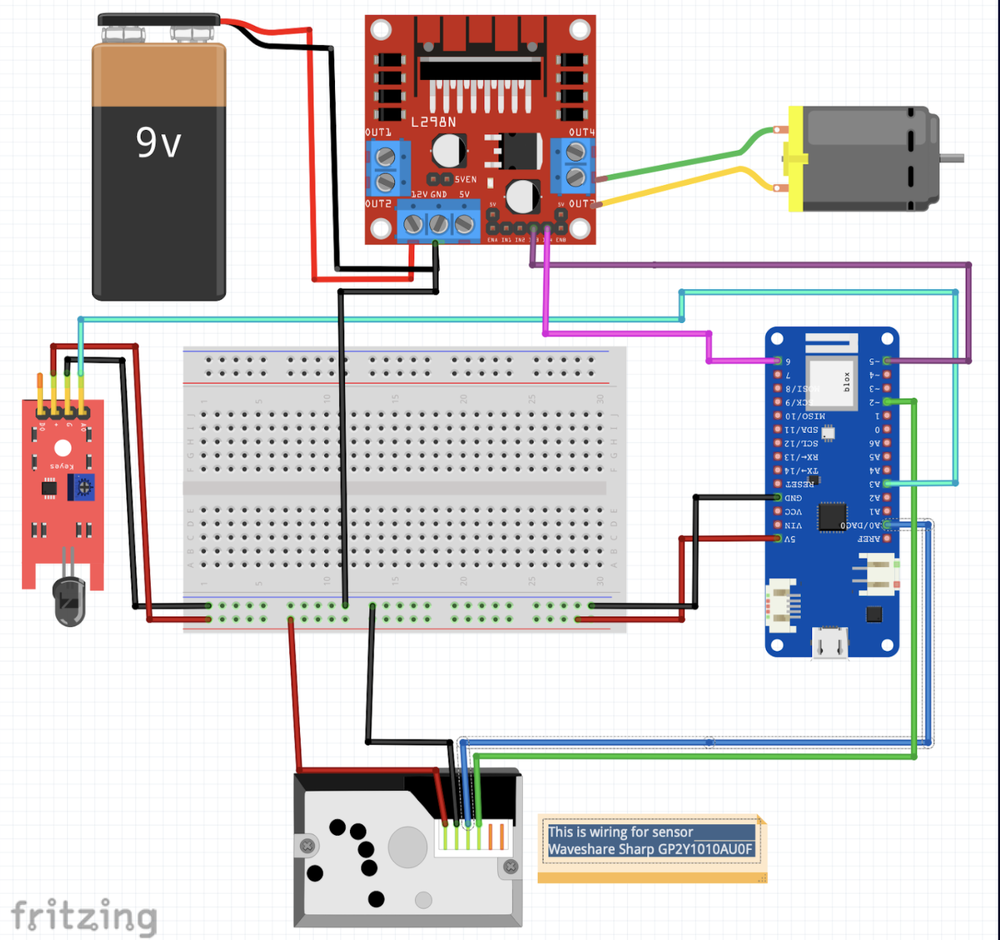

# (WIP) Candle monitoring with Grafana stack

The candle monitoring system helps you learn more about your candle burning activities and lets you extiguish your candle directly from Grafana. It monitors if candle's flame and released PM particles.

This project was part of **[GrafanaCONline 2021 Easy DIY IoT projects with Grafana](https://grafana.com/go/grafanaconline/2021/diy-iot/)** session.

## Hardware

To build this system, you will need:

- **1 [Waveshare Sharp GP2Y1010AU0F](https://www.waveshare.com/dust-sensor.htm)** sensor for PM paricles
- **1 [Flame sensor](https://www.electronicshub.org/arduino-flame-sensor-interface/)** to detect flame
- **1 [Arduino Uno WiFi Rev2](https://www.arduino.cc/en/Guide/ArduinoUnoWiFiRev2)** development board
- **F-F, M-F && M-M Dupont cables**
- **1 micro USB cable**
- **1 USB charger**

Plus:
- **Box or stand** to put this all together and build the monitoring system

## Libraries:

- **WiFiNINA** library by Arduino 
- **ArduinoHttpClient** by Arduino
- **NTP Client** by Fabrice Weinberg
- **Loki** *needs to be added*
- **Prometheus/Cortex** *needs to be added*

## Circuit & Wiring diagrams

## Data storage and visualisation

We are using free tier of [Grafana Cloud](https://grafana.com/products/cloud/) that comes with hosted [Loki](https://grafana.com/oss/loki/) (logs), [Prometheus](https://grafana.com/oss/prometheus/) (metrics) and [Grafana](https://grafana.com/oss/grafana/) (visualisation). As soon as your account is all set up, you can see the portal with the hosted Grafana, Loki, and Prometheus instances. Created API keys for Loki and Prometheus to publish metrics from the monitoring system to these databases. Update API keys in the config file.

